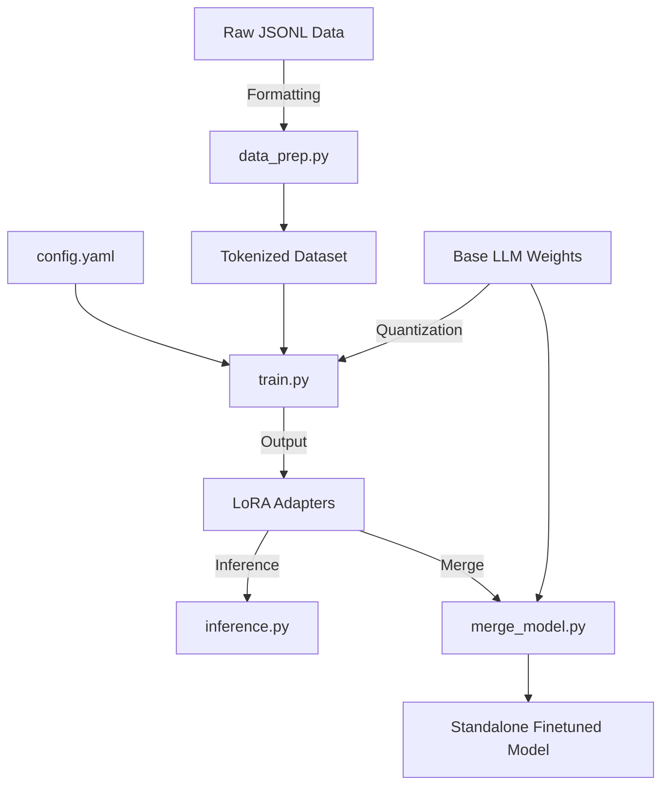

# 🧠 LLM Fine-Tuning Pipeline (LoRA / QLoRA)


A complete, production-ready pipeline for fine-tuning Large Language Models (LLMs) like LLaMA-2 and Mistral using QLoRA (Quantized Low-Rank Adaptation). This repository allows you to efficiently fine-tune models on consumer hardware by leveraging 4-bit quantization and PEFT techniques.

## ✨ Features

- **Efficient Fine-Tuning**: Uses `bitsandbytes` for 4-bit quantization (QLoRA) to drastically reduce VRAM usage.
- **Configurable Hyperparameters**: Easily tweak learning rate, batch size, and LoRA parameters via `config.yaml`.
- **Custom Dataset Preparation**: Standardized utility to ingest JSONL data and format it into instruction-response pairs.
- **Merge Utilities**: Script to merge LoRA adapters back into the base model weights for deployment.
- **Inference Script**: Built-in CLI for testing the fine-tuned model interactively.

## 🏗️ Architecture



## 🚀 Installation

1. **Clone the repository:**
   ```bash
   git clone https://github.com/yourusername/llm-fine-tuning-lora.git
   cd llm-fine-tuning-lora
   ```

2. **Install dependencies:**
   ```bash
   pip install -r requirements.txt
   ```
   *(Note: Ensure you have appropriate NVIDIA drivers and CUDA installed for PyTorch).*

## 💻 Usage

1. **Configure parameters:** Edit `config.yaml` to specify your base model, dataset path, and hyperparams.
2. **Train the model:**
   ```bash
   python train.py
   ```
3. **Test the fine-tuned model:**
   ```bash
   python inference.py
   ```
4. **(Optional) Merge adapters into the base model:**
   ```bash
   python merge_model.py
   ```

## 📊 Results & Hardware Specs
Training a 7B model using QLoRA config requires approximately 10GB of VRAM, making it fully viable on an RTX 3080/4090.
